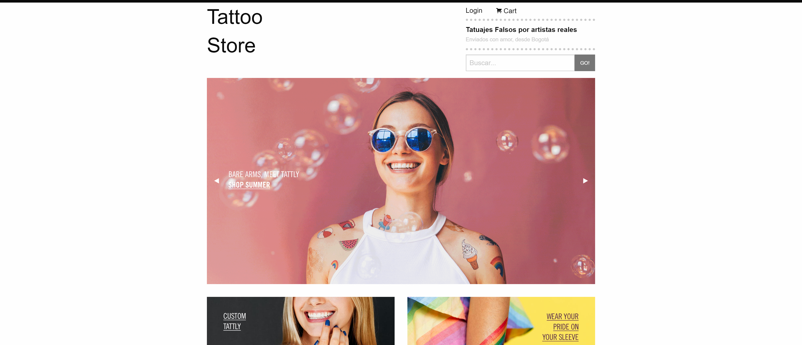

# Tattoo Store (Foundation)

¡Bienvenido y gracias por visitarme! Este es un proyecto elaborado como proyecto de aprendizaje de Foundation en [Platzi](https://platzi.com/cursos/foundation/) en donde aplico varios de los conocimientos y habilidades adquiridas, entre ellas:

- Reconocer Foundation como framework frontend
- Desarrollar sitios web con Foundation
- Crear carruseles, barras y listas
- Usar la grilla responsive de Foundation

## Tecnologías usadas

- HTML
- Foundation

Deploy con:

- Github Pages

## Vista de Home

## [Ver la aplicación](https://diegoalesco95.github.io/Platzi-foundation-prod/)

## Licencia

[MIT License](LICENSE)
